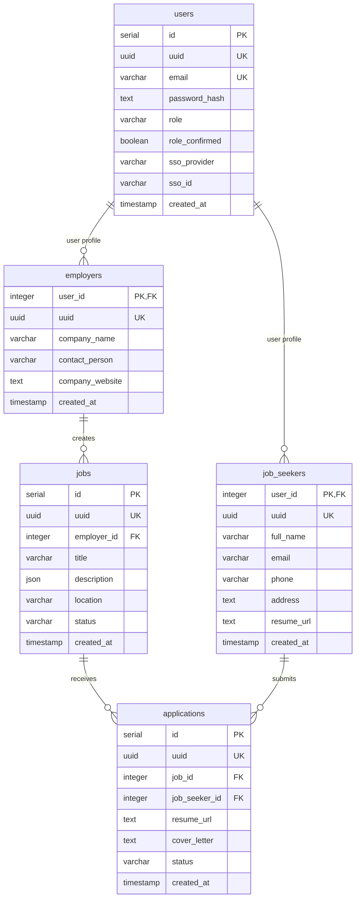
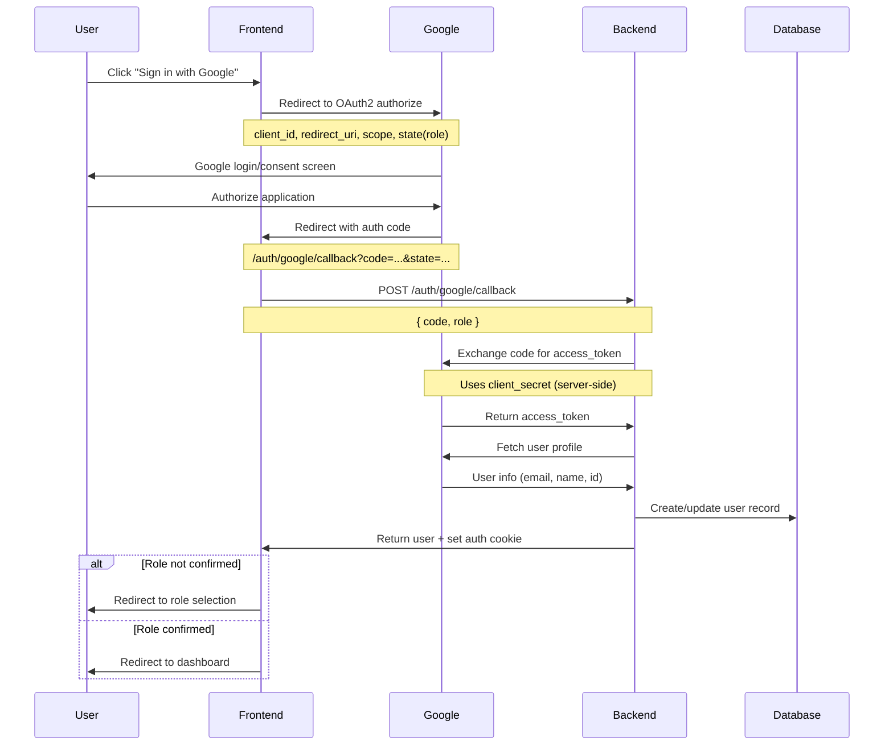

# Job Board Application - Design Document

## Table of Contents

1. [Architecture Overview](#architecture-overview)
2. [Database Schema Design](#database-schema-design)
3. [Authentication Strategy](#authentication-strategy)
4. [OAuth2 Integration](#oauth2-integration)
5. [Backend Architecture](#backend-architecture)
6. [Frontend Architecture](#frontend-architecture)
7. [Security Considerations](#security-considerations)
8. [Technology Stack Rationale](#technology-stack-rationale)

## Architecture Overview

The job board application follows a modern **full-stack architecture** with clear separation between frontend and backend services:

```
┌─────────────────┐    HTTP/REST    ┌─────────────────┐    SQL    ┌─────────────────┐
│                 │    + Cookies    │                 │  Queries  │                 │
│   React SPA     │◄──────────────► │  Express.js API │◄─────────► │  PostgreSQL DB  │
│   (Frontend)    │                 │   (Backend)     │           │                 │
└─────────────────┘                 └─────────────────┘           └─────────────────┘
         │                                    │
         │                                    │
         ▼                                    ▼
┌─────────────────┐                 ┌─────────────────┐
│  Redux Store    │                 │  Redis Cache    │
│  (State Mgmt)   │                 │  (Sessions)     │
└─────────────────┘                 └─────────────────┘
```

**Key Design Principles:**

- **Separation of Concerns**: Clear API boundaries between frontend and backend
- **Security-First**: JWT-based authentication with HttpOnly cookies
- **Scalability**: Modular backend structure with distinct service layers
- **Type Safety**: Full TypeScript implementation across the stack
- **Performance**: Strategic database indexing and caching layer

## Database Schema Design

### Entity Relationship Diagram



### Key Design Decisions

#### 1. **User Role Architecture**

- **Single `users` table** for authentication data
- **Separate profile tables** (`job_seekers`, `employers`) for role-specific data
- **Role confirmation system** allows deferred role selection during SSO signup

**Benefits:**

- Reduces data duplication
- Supports future role extensions
- Enables account linking across SSO providers

#### 2. **UUID Strategy**

- **Auto-generated UUIDs** for all entities alongside serial PKs
- **Public-facing identifiers** use UUIDs to prevent enumeration attacks
- **Internal joins** use serial IDs for better performance

#### 3. **Optimized Indexing**

```sql
-- Strategic indexes for common query patterns
CREATE INDEX users_role_created_at_idx ON users(role, created_at);
CREATE INDEX jobs_status_created_at_idx ON jobs(status, created_at);
CREATE INDEX applications_job_seeker_id_idx ON applications(job_seeker_id);
CREATE UNIQUE INDEX applications_job_id_job_seeker_id_uniq
    ON applications(job_id, job_seeker_id);
```

**Performance Considerations:**

- **Composite indexes** for multi-column WHERE clauses
- **Unique constraint** prevents duplicate job applications
- **Foreign key indexes** for efficient joins

#### 4. **JSON Storage for Rich Content**

- **Job descriptions** stored as JSON to support rich text formatting
- **Flexible structure** allows for complex job requirements, benefits, etc.
- **Frontend rendering** with custom block editor components

## Authentication Strategy

### Hybrid Authentication Model

The application supports both **traditional password-based** and **OAuth2 SSO** authentication:

```typescript
// User record supports both auth methods
interface User {
  email: string;
  passwordHash?: string; // Password-based users
  ssoProvider?: 'google'; // SSO users
  ssoId?: string; // External provider ID
  roleConfirmed: boolean; // Deferred role selection
}
```

### Session Management

#### JWT + HttpOnly Cookies Approach

```typescript
// JWT Configuration
const authConfig = {
  jwtSecret: process.env.JWT_SECRET,
  jwtExpiresIn: '7d',
  cookieOptions: {
    httpOnly: true, // Prevents XSS attacks
    secure: true, // HTTPS-only in production
    sameSite: 'lax', // CSRF protection
    maxAge: 7 * 24 * 60 * 60 * 1000, // 7 days
  },
};
```

**Why HttpOnly Cookies?**

- **XSS Protection**: Token not accessible via JavaScript
- **Automatic Management**: Browser handles sending/receiving
- **CSRF Protection**: SameSite attribute prevents cross-site attacks

#### Authentication Flow

1. **Login** → Backend validates credentials → Issues JWT in HttpOnly cookie
2. **Requests** → Browser automatically sends cookie → Middleware validates JWT
3. **Logout** → Backend clears cookie → Client redirected to login

```typescript
// Middleware validation
async function authMiddleware(req, res, next) {
  const token = req.cookies.authToken;
  const payload = jwt.verify(token, authConfig.jwtSecret);
  const user = await UserRepository.findById(payload.userId);
  req.user = user;
  next();
}
```

### Password Security

- **bcrypt hashing** with salt rounds 12
- **No plaintext storage** of passwords
- **Secure password requirements** enforced client-side and server-side

## OAuth2 Integration

### Google OAuth2 Implementation

**Provider Choice: Google OAuth2**

**Rationale:**

- **Ubiquitous adoption**: Most users have Google accounts
- **Excellent documentation**: Well-supported OAuth2 implementation
- **Enterprise ready**: Supports both personal and G Suite accounts
- **Security standards**: Follows OAuth2.0 and OpenID Connect specifications

### OAuth2 Flow Architecture



### Key Implementation Features

#### 1. **Secure Token Exchange**

```typescript
// Backend-only client secret usage
const tokenResponse = await fetch('https://oauth2.googleapis.com/token', {
  method: 'POST',
  body: new URLSearchParams({
    client_id: process.env.GOOGLE_CLIENT_ID,
    client_secret: process.env.GOOGLE_CLIENT_SECRET, // Server-side only!
    code: authorizationCode,
    grant_type: 'authorization_code',
    redirect_uri: process.env.GOOGLE_REDIRECT_URI,
  }),
});
```

#### 2. **Dynamic Redirect URI**

```typescript
// Environment-configurable redirect URI
const redirectUri =
  process.env.GOOGLE_REDIRECT_URI ||
  `${req.get('origin')}/auth/google/callback`;
```

#### 3. **State-based Role Passing**

```typescript
// Frontend: Encode role in OAuth state parameter
const authUrl = `https://accounts.google.com/o/oauth2/v2/auth?${params}`;
params.set('state', JSON.stringify({ role }));

// Backend: Extract role from state
const stateData = JSON.parse(req.query.state);
const role = stateData.role;
```

#### 4. **Account Linking Strategy**

```typescript
// Link SSO to existing email accounts
const existingUser = await UserRepository.findByEmail(googleUser.email);
if (existingUser) {
  await UserRepository.updateById(existingUser.id, {
    ssoProvider: 'google',
    ssoId: googleUser.id,
  });
}
```

## Backend Architecture

### Modular Express.js Structure

```
apps/backend/src/
├── config/           # Environment and app configuration
├── database/         # Database layer
│   ├── models/       # Drizzle ORM schema definitions
│   ├── repository/   # Data access layer
│   └── migrations/   # Database migration files
├── middleware/       # Express middleware functions
├── modules/          # Feature-based modules
│   ├── auth/         # Authentication logic
│   ├── jobs/         # Job management
│   ├── employer/     # Employer-specific features
│   └── applications/ # Application management
└── services/         # Business logic services
```

### Key Architectural Decisions

#### 1. **Repository Pattern**

```typescript
// Clean separation of data access
class UserRepository {
  static async findById(id: number): Promise<User | null> {
    return await db.select().from(users).where(eq(users.id, id));
  }

  static async findBySsoProviderAndId(provider: string, ssoId: string) {
    return await db
      .select()
      .from(users)
      .where(and(eq(users.ssoProvider, provider), eq(users.ssoId, ssoId)));
  }
}
```

**Benefits:**

- **Testability**: Easy to mock database operations
- **Consistency**: Standardized data access patterns
- **Maintainability**: Database logic centralized

#### 2. **Middleware-Driven Request Processing**

```typescript
// Authentication pipeline
router.post(
  '/protected-route',
  authRateLimit, // Rate limiting
  validateRequest(schema), // Input validation
  authMiddleware, // JWT validation
  requireRole('employer'), // Role-based access
  controller.method, // Business logic
);
```

#### 3. **Type-Safe API Contracts**

```typescript
// Zod schema validation
const registerSchema = z.object({
  email: z.string().email(),
  password: z.string().min(8),
  role: z.enum(['job_seeker', 'employer']),
});

type RegisterRequest = z.infer<typeof registerSchema>;
```

#### 4. **Security Middleware Stack**

```typescript
app.use(helmet()); // Security headers
app.use(cors(corsConfig)); // CORS policy
app.use(xss()); // XSS protection
app.use(globalRateLimit); // DDoS protection
app.use(cookieParser()); // Cookie handling
```

### Database Integration

#### Drizzle ORM Selection

**Why Drizzle?**

- **Type-safe queries**: Full TypeScript inference
- **Lightweight**: No runtime overhead
- **SQL-first**: Direct control over generated queries
- **Migration support**: Schema versioning and updates

```typescript
// Type-safe query example
const jobsWithEmployer = await db
  .select({
    id: jobs.id,
    title: jobs.title,
    companyName: employers.companyName,
  })
  .from(jobs)
  .leftJoin(employers, eq(jobs.employerId, employers.userId))
  .where(eq(jobs.status, 'active'));
```

## Frontend Architecture

### React + TypeScript SPA

```
apps/frontend/src/
├── modules/              # Feature-based modules
│   ├── auth/             # Authentication components
│   ├── job-browsing/     # Job search and application
│   ├── employer/         # Employer dashboard
│   └── application-review/ # Application management
├── shared/               # Shared components and utilities
│   ├── components/       # Reusable UI components
│   ├── store/           # Redux store configuration
│   └── types/           # TypeScript type definitions
└── services/            # API communication layer
```

### Key Architectural Decisions

#### 1. **Redux Toolkit for State Management**

```typescript
// Centralized auth state
const authSlice = createSlice({
  name: 'auth',
  initialState: { user: null, isLoading: false },
  reducers: {
    loginStart: (state) => {
      state.isLoading = true;
    },
    loginSuccess: (state, action) => {
      state.user = action.payload;
      state.isLoading = false;
    },
  },
});
```

**Benefits:**

- **Predictable state updates**: Immutable state transitions
- **DevTools integration**: Time-travel debugging
- **Boilerplate reduction**: RTK simplifies Redux setup

#### 2. **Module-Based Organization**

```typescript
// Feature modules with co-located concerns
modules/auth/
├── components/    # Auth-specific UI
├── services/      # API calls
├── store/         # Auth state slice
├── types/         # Auth type definitions
└── hooks/         # Custom React hooks
```

#### 3. **Custom Hooks for Business Logic**

```typescript
// Reusable authentication logic
export const useAuth = () => {
  const user = useAppSelector((state) => state.auth.user);
  const dispatch = useAppDispatch();

  const login = useCallback(
    async (credentials) => {
      dispatch(loginStart());
      const result = await authService.login(credentials);
      dispatch(loginSuccess(result.user));
    },
    [dispatch],
  );

  return { user, login, isAuthenticated: !!user };
};
```

#### 4. **Protected Route Architecture**

```typescript
// Role-based route protection
const ProtectedRoute = ({ children, requiredRole }) => {
  const { user, isAuthenticated } = useAuth();

  if (!isAuthenticated) return <Navigate to="/auth/login" />;
  if (requiredRole && user.role !== requiredRole) return <Unauthorized />;

  return children;
};
```

### Build Tools and Development

#### Vite for Development Experience

**Why Vite?**

- **Lightning fast HMR**: Instant feedback during development
- **ES modules**: Native browser module support
- **TypeScript support**: Zero-config TypeScript integration
- **Optimized builds**: Rollup-based production bundles

## Security Considerations

### Authentication Security

1. **JWT Secret Management**: Strong, environment-specific secrets
2. **HttpOnly Cookies**: XSS-resistant token storage
3. **CSRF Protection**: SameSite cookie attributes
4. **Rate Limiting**: Brute force attack prevention

### Input Validation

```typescript
// Server-side validation with Zod
const jobSchema = z.object({
  title: z.string().min(1).max(255),
  description: z.object({}).passthrough(),
  location: z.string().max(255).optional(),
});

// Automatic validation middleware
router.post('/jobs', validateRequest(jobSchema), controller.createJob);
```

### Database Security

- **Prepared statements**: SQL injection prevention via Drizzle ORM
- **Principle of least privilege**: Database user permissions
- **Connection pooling**: Resource management and DOS prevention

### File Upload Security

```typescript
// Secure file handling
const upload = multer({
  storage: diskStorage({ destination: './uploads/resumes' }),
  limits: { fileSize: 5 * 1024 * 1024 }, // 5MB limit
  fileFilter: (req, file, cb) => {
    const allowed = ['.pdf', '.doc', '.docx'];
    const ext = path.extname(file.originalname);
    cb(null, allowed.includes(ext));
  },
});
```

## Technology Stack Rationale

### Backend Technology Choices

| Technology            | Rationale                                                      |
| --------------------- | -------------------------------------------------------------- |
| **Node.js + Express** | JavaScript ecosystem consistency, extensive middleware support |
| **TypeScript**        | Type safety, better IDE support, reduced runtime errors        |
| **PostgreSQL**        | ACID compliance, complex query support, excellent performance  |
| **Drizzle ORM**       | Type-safe queries, lightweight, SQL-first approach             |
| **Redis**             | Session storage, caching layer, rate limiting support          |
| **JWT**               | Stateless authentication, scalable across services             |

### Frontend Technology Choices

| Technology          | Rationale                                                        |
| ------------------- | ---------------------------------------------------------------- |
| **React 18**        | Component reusability, excellent ecosystem, concurrent features  |
| **TypeScript**      | Type safety consistency with backend, better refactoring         |
| **Redux Toolkit**   | Predictable state management, DevTools, time-travel debugging    |
| **React Router v7** | Declarative routing, nested routes, code splitting               |
| **Tailwind CSS**    | Utility-first styling, consistent design system, smaller bundles |
| **Vite**            | Fast development experience, optimized builds, ES modules        |

### Development Tools

| Tool                    | Purpose                                 |
| ----------------------- | --------------------------------------- |
| **ESLint + Prettier**   | Code quality and formatting consistency |
| **Husky + lint-staged** | Pre-commit hooks for quality gates      |
| **Jest + Supertest**    | Unit and integration testing            |
| **Docker Compose**      | Development environment consistency     |

---

## Future Architectural Considerations

1. **Microservices Migration**: As the application scales, consider breaking into service-oriented architecture
2. **Message Queues**: Add Redis queues for background job processing (email notifications, etc.)
3. **CDN Integration**: Static asset delivery optimization
4. **Database Sharding**: Horizontal scaling strategies for large datasets
5. **API Rate Limiting**: More sophisticated rate limiting strategies
6. **Monitoring & Observability**: APM integration, structured logging, metrics collection

This architecture provides a solid foundation for a production-ready job board application while maintaining flexibility for future enhancements and scaling requirements.
