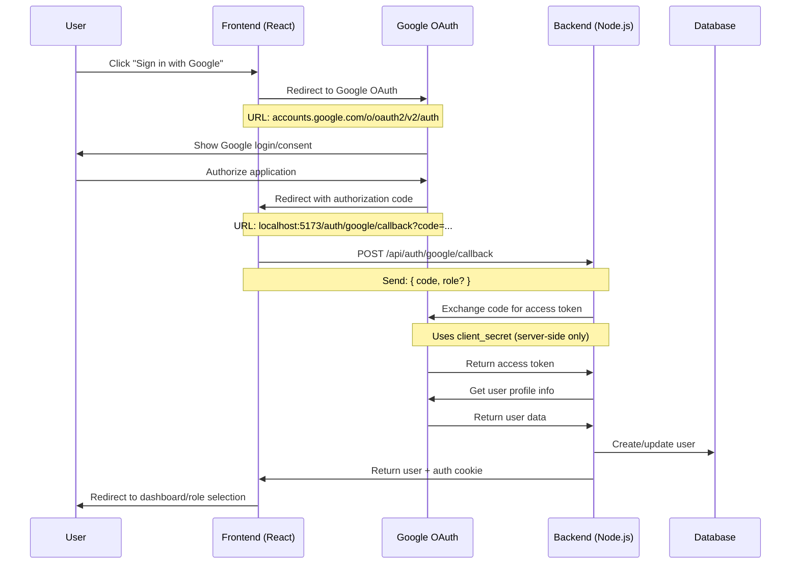

# Single Sign-On (SSO) Implementation

This document describes the SSO authentication flow implemented in the job board application, specifically for Google OAuth integration.

## Architecture Overview

The application uses a **frontend-handled OAuth flow** with backend validation for security. This approach provides the best balance of user experience, security, and flexibility.



## Flow Details

### 1. User Initiates OAuth

**Frontend Action:**

```typescript
// User clicks Google sign-in button
googleOAuthService.startGoogleAuth(role);
```

**What Happens:**

- Frontend redirects user to Google OAuth URL
- URL includes: `client_id`, `redirect_uri`, `scope`, `state` (with role)
- User sees Google's authorization screen

### 2. Google Authorization

**User Actions:**

- Signs in to Google account (if not already)
- Reviews and approves application permissions
- Google validates the request

**Google Response:**

- Redirects back to: `http://localhost:5173/auth/google/callback`
- Includes authorization `code` in URL parameters
- Includes `state` parameter (contains role information)

### 3. Frontend Callback Processing

**File:** `src/modules/auth/components/GoogleCallback.tsx`

```typescript
// Extract parameters from callback URL
const code = urlParams.get('code');
const state = urlParams.get('state');

// Parse role from state
let role = 'job_seeker'; // default
if (state) {
  const stateData = JSON.parse(state);
  role = stateData.role;
}

// Send to backend for processing
const response = await fetch('/api/auth/google/callback', {
  method: 'POST',
  body: JSON.stringify({ code, role }),
  credentials: 'include',
});
```

### 4. Backend Token Exchange & User Creation

**File:** `src/modules/auth/auth.controller.ts` - `googleCallback` method

**Step 1: Exchange Code for Token**

```typescript
const tokenResponse = await fetch('https://oauth2.googleapis.com/token', {
  method: 'POST',
  body: new URLSearchParams({
    client_id: process.env.GOOGLE_CLIENT_ID,
    client_secret: process.env.GOOGLE_CLIENT_SECRET, // Server-side only!
    code,
    grant_type: 'authorization_code',
    redirect_uri: 'http://localhost:5173/auth/google/callback',
  }),
});
```

**Step 2: Get User Information**

```typescript
const userInfo = await fetch(
  `https://www.googleapis.com/oauth2/v2/userinfo?access_token=${token}`,
);
```

**Step 3: Create/Update User**

```typescript
// Check if user exists by Google ID or email
let user = await UserRepository.findBySsoProviderAndId('google', userInfo.id);

if (!user) {
  // Create new user or link to existing email
  user = await UserRepository.create({
    email: userInfo.email,
    role: role || 'job_seeker',
    roleConfirmed: !!role,
    ssoProvider: 'google',
    ssoId: userInfo.id,
  });

  // Create appropriate profile
  if (role === 'employer') {
    await EmployerRepository.create({ userId: user.id, ... });
  } else if (role === 'job_seeker') {
    await JobSeekerRepository.create({ userId: user.id, ... });
  }
}
```

**Step 4: Create Session**

```typescript
// Generate JWT token
const token = jwt.sign({ userId: user.id }, authConfig.jwtSecret);

// Set authentication cookie
res.cookie(authConfig.cookieName, token, authConfig.cookieOptions);

// Return user data
res.json({ success: true, user });
```

### 5. Frontend Post-Authentication

**Role Confirmation Check:**

```typescript
// Update Redux state
dispatch({ type: 'auth/login/fulfilled', payload: user });

// Handle role confirmation
if (!user.roleConfirmed) {
  navigate('/auth/select-role'); // User needs to pick role
} else {
  // Redirect to appropriate dashboard
  navigate(
    user.role === 'employer' ? '/dashboard/employer' : '/dashboard/job-seeker',
  );
}
```

## Role Selection Flow

For users who sign up via SSO without explicitly selecting a role:

### 1. Deferred Role Selection

- User completes OAuth but hasn't selected job seeker vs employer
- `roleConfirmed: false` is set in user record
- User is redirected to role selection page

### 2. Role Selection Endpoint

**Endpoint:** `POST /api/auth/select-role`

```typescript
// User selects role on frontend
const response = await fetch('/api/auth/select-role', {
  method: 'POST',
  body: JSON.stringify({ role: 'employer' }),
  credentials: 'include',
});

// Backend updates user and creates profile
await UserRepository.updateById(userId, {
  role,
  roleConfirmed: true,
});

// Create appropriate profile (employer/job seeker)
```

## Security Considerations

### ✅ Client Secret Protection

- `GOOGLE_CLIENT_SECRET` is **never** exposed to frontend
- Token exchange happens server-side only
- Frontend only handles public authorization codes

### ✅ CSRF Protection

- `state` parameter prevents CSRF attacks
- Contains encrypted role information
- Validated on callback

### ✅ Cookie Security

```typescript
// Secure authentication cookies
cookieOptions: {
  httpOnly: true,      // Prevent XSS
  secure: true,        // HTTPS only in production
  sameSite: 'strict',  // CSRF protection
  maxAge: 24 * 60 * 60 * 1000 // 24 hours
}
```

### ✅ Input Validation

- All OAuth parameters are validated
- Role selection is restricted to allowed values
- Email format validation

## Configuration

### Environment Variables

**Frontend (.env):**

```bash
VITE_GOOGLE_CLIENT_ID=your-client-id.apps.googleusercontent.com
VITE_API_BASE_URL=http://localhost:5173/api
```

**Backend (.env):**

```bash
GOOGLE_CLIENT_ID=your-client-id.apps.googleusercontent.com
GOOGLE_CLIENT_SECRET=your-client-secret
JWT_SECRET=your-jwt-secret
```

### Google Cloud Console Setup

1. **Create OAuth 2.0 Client ID**
   - Application type: Web application
   - Name: Job Board Application

2. **Authorized JavaScript Origins:**

   ```
   http://localhost:5173      (development)
   https://yourdomain.com     (production)
   ```

3. **Authorized Redirect URIs:**

   ```
   http://localhost:5173/auth/google/callback      (development)
   https://yourdomain.com/auth/google/callback     (production)
   ```

## API Endpoints

### `POST /api/auth/google/callback`

Handles Google OAuth callback with authorization code.

**Request:**

```json
{
  "code": "authorization_code_from_google",
  "role": "job_seeker" // optional
}
```

**Response:**

```json
{
  "success": true,
  "user": {
    "id": 123,
    "email": "user@example.com",
    "role": "job_seeker",
    "roleConfirmed": true,
    "uuid": "user-uuid"
  }
}
```

### `POST /api/auth/select-role`

Allows users to select their role after SSO registration.

**Request:**

```json
{
  "role": "employer"
}
```

**Response:**

```json
{
  "success": true,
  "user": {
    "id": 123,
    "role": "employer",
    "roleConfirmed": true
  }
}
```

## Frontend Routes

- `/auth/google/callback` - Google OAuth callback handler
- `/auth/select-role` - Role selection for new SSO users

## Error Handling

### Common Error Scenarios

1. **Invalid Authorization Code**

   ```json
   { "error": "Failed to exchange authorization code" }
   ```

2. **User Creation Failure**

   ```json
   { "error": "Failed to create user account" }
   ```

3. **Missing Configuration**

   ```json
   { "error": "Google Client ID not configured" }
   ```

### Frontend Error Handling

```typescript
try {
  // OAuth flow
} catch (error) {
  setError(error.message);
  setTimeout(() => navigate('/auth/login'), 3000);
}
```

## Testing

### Manual Testing Checklist

- [ ] Google OAuth redirects correctly
- [ ] Authorization code is received
- [ ] Backend processes code successfully
- [ ] User is created/updated in database
- [ ] Authentication cookie is set
- [ ] User is redirected to correct dashboard
- [ ] Role selection works for new users
- [ ] Error handling displays appropriate messages

### Development Tips

1. **Debug Mode:** Add console logging to see OAuth flow
2. **Network Tab:** Monitor API calls during authentication
3. **Cookie Inspector:** Verify authentication cookies are set
4. **Database:** Check user creation in database

## Future Enhancements

- [ ] Add Microsoft OAuth support
- [ ] Implement LinkedIn OAuth
- [ ] Add account linking for multiple SSO providers
- [ ] Implement OAuth token refresh
- [ ] Add audit logging for authentication events
